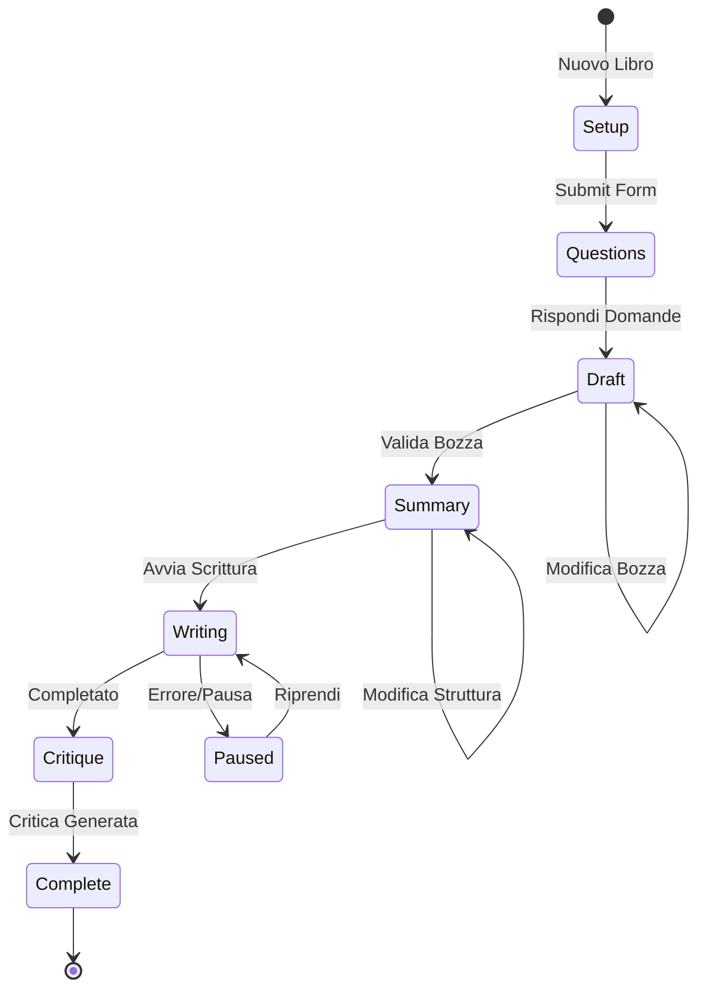

# Documentazione Funzionale - NarrAI

## Indice

1. [Flusso Generazione Libro](#flusso-generazione-libro)
2. [Autenticazione e Autorizzazione](#autenticazione-e-autorizzazione)
3. [Logiche di Business](#logiche-di-business)
4. [Interfaccia Utente](#interfaccia-utente)
5. [Gestione Sessioni](#gestione-sessioni)
6. [Sistema Critica Letteraria](#sistema-critica-letteraria)
7. [Export Multiformato](#export-multiformato)
8. [Statistiche e Analytics](#statistiche-e-analytics)
9. [Validazioni e Regole](#validazioni-e-regole)

## Flusso Generazione Libro

Il processo di generazione di un libro segue un workflow sequenziale con 6 fasi principali:



### Step 1: Setup (Configurazione Iniziale)

**Descrizione**: L'utente compila un form dinamico configurato tramite YAML.

**Input**:
- Trama (obbligatoria)
- Modello LLM (default: "gemini-3-flash-preview")
- Parametri opzionali: genere, sottogenere, tema, stile, punto di vista, ecc.

**Processo**:
1. Frontend carica configurazione da `/api/config`
2. Form dinamico costruito basandosi su `inputs.yaml`
3. Validazione lato client e server
4. Creazione sessione con `session_id` univoco

**Output**: `SubmissionResponse` con `session_id`

**File**: `backend/app/api/routers/submission.py`, `frontend/src/components/DynamicForm.tsx`

## Autenticazione e Autorizzazione

### Sistema di Registrazione e Login

L'applicazione implementa un sistema completo di autenticazione utenti con registrazione, login, verifica email e reset password.

#### Registrazione Utente

**Processo**:
1. Utente compila form registrazione (nome, email, password)
2. Chiamata a `POST /api/auth/register`
3. Verifica email non già esistente
4. Hash password con bcrypt
5. Creazione utente in UserStore (MongoDB) con `is_verified=False`
6. Generazione token di verifica (32 caratteri URL-safe)
7. Invio email di verifica tramite EmailService (SMTP)
8. Risposta con messaggio di successo

**Validazioni**:
- Email univoca (verifica duplicati)
- Password minimo 8 caratteri (validazione frontend/backend)
- Email formato valido

**File**: `backend/app/api/routers/auth.py`, `backend/app/agent/user_store.py`, `backend/app/services/email_service.py`

#### Verifica Email

**Processo**:
1. Utente clicca link verifica nell'email (token nella query string)
2. Frontend chiama `GET /api/auth/verify?token=...`
3. Backend valida token (verifica esistenza e scadenza, default 24h)
4. Aggiornamento utente: `is_verified=True`
5. Utente può effettuare login

**Scadenza Token**: 24 ore (configurabile)

**File**: `backend/app/api/routers/auth.py` (`verify_email_endpoint`)

#### Login

**Processo**:
1. Utente inserisce email e password
2. Chiamata a `POST /api/auth/login`
3. Verifica utente esistente
4. Verifica password (bcrypt compare)
5. Verifica utente attivo (`is_active=True`)
6. Verifica email verificata (`is_verified=True`)
7. Creazione sessione (UUID session_id salvato in MongoDB collection `sessions_auth`)
8. Impostazione cookie `session_id` (httpOnly, 7 giorni scadenza)
9. Risposta con dati utente (senza password)

**Gestione Errori**:
- Email/password non corretti → 401
- Utente disattivato → 403
- Email non verificata → 403 con codice `EMAIL_NOT_VERIFIED`

**File**: `backend/app/api/routers/auth.py` (`login`), `backend/app/middleware/auth.py` (`create_session`)

#### Password Reset

**Processo**:
1. Utente richiede reset password (`POST /api/auth/forgot-password` con email)
2. Generazione token reset (32 caratteri, scadenza 1h)
3. Salvataggio token in UserStore
4. Invio email con link reset
5. Utente clicca link e inserisce nuova password
6. Chiamata `POST /api/auth/reset-password` con token e nuova password
7. Validazione token e scadenza
8. Hash nuova password
9. Aggiornamento password in UserStore
10. Invalidazione token

**Scadenza Token**: 1 ora

**File**: `backend/app/api/routers/auth.py` (`forgot_password`, `reset_password`)

#### Logout

**Processo**:
1. Chiamata `POST /api/auth/logout`
2. Eliminazione sessione da MongoDB
3. Rimozione cookie `session_id`
4. Risposta success

**File**: `backend/app/api/routers/auth.py` (`logout`), `backend/app/middleware/auth.py` (`delete_session`)

### Role-Based Access Control (RBAC)

Il sistema supporta due ruoli utente:

- **user**: Ruolo default, accesso a tutte le funzionalità base
- **admin**: Ruolo privilegiato, accesso aggiuntivo a:
  - Sezione **Analisi** (Analytics dashboard)
  - Endpoint statistiche globali (`/api/library/stats`, `/api/library/stats/advanced`)
  - Endpoint statistiche utenti (`/api/admin/users/stats`)
  - Gestione ruoli utenti (`PATCH /api/auth/users/{user_id}/role`)

#### Gestione Ruoli

**Endpoint Admin**:
- `PATCH /api/auth/users/{user_id}/role`: Cambia ruolo utente (richiede admin)
- `GET /api/auth/users/by-email/{email}`: Cerca utente per email (richiede admin)

**Middleware**:
- `get_current_user`: Dependency FastAPI per ottenere utente corrente (richiede autenticazione)
- `get_current_user_optional`: Dependency opzionale (restituisce None se non autenticato)
- `require_admin`: Dependency che verifica ruolo admin (403 se non admin)

**File**: `backend/app/middleware/auth.py`, `backend/app/api/routers/auth.py`

### Protezione Endpoint

Gli endpoint sono protetti usando FastAPI Dependencies:

**Endpoint Autenticati** (richiedono login):
- Tutti gli endpoint `/api/library/*` (libreria utente)
- Endpoint generazione libro (`/api/book/*`)
- Endpoint export (`/api/book/export/*`)

**Endpoint Admin-Only**:
- `/api/library/stats`: Statistiche globali
- `/api/library/stats/advanced`: Statistiche avanzate
- `/api/admin/users/stats`: Statistiche utenti
- `/api/auth/users/{user_id}/role`: Gestione ruoli

**Endpoint Pubblici**:
- `/api/config`: Configurazione form
- `/api/auth/register`: Registrazione
- `/api/auth/login`: Login
- `/api/auth/verify`: Verifica email
- `/api/auth/forgot-password`: Richiesta reset password
- `/api/auth/reset-password`: Reset password

**File**: `backend/app/main.py`, `backend/app/middleware/auth.py`

### Persistenza Utenti

Gli utenti sono salvati in MongoDB (collection `users`) tramite `UserStore`:

**Struttura User**:
```python
class User:
    id: str  # UUID
    email: str  # unique
    password_hash: str  # bcrypt hash
    name: str
    role: Literal["user", "admin"] = "user"
    is_active: bool = True
    is_verified: bool = False
    created_at: datetime
    updated_at: datetime
    password_reset_token: Optional[str]
    password_reset_expires: Optional[datetime]
    verification_token: Optional[str]
    verification_expires: Optional[datetime]
```

**Sessioni Auth**:
- Collection MongoDB: `sessions_auth`
- Campi: `session_id` (UUID), `user_id`, `created_at`, `expires_at`
- Scadenza: 7 giorni (configurabile via `SESSION_EXPIRE_DAYS`)

**File**: `backend/app/models.py` (`User`), `backend/app/agent/user_store.py`, `backend/app/middleware/auth.py`

### Email Service

Il sistema utilizza SMTP per invio email (verifica e password reset):

**Configurazione** (variabili d'ambiente):
- `SMTP_HOST`: Server SMTP (default: `smtp.gmail.com`)
- `SMTP_PORT`: Porta SMTP (default: `587`)
- `SMTP_USER`: Email mittente
- `SMTP_PASSWORD`: Password/App Password
- `FRONTEND_URL`: URL frontend per link email (default: `http://localhost:5173`)

**Tipo Email**:
- Email verifica: HTML + testo, link con token
- Email password reset: HTML + testo, link con token

**Fallback**: Se credenziali SMTP non configurate, email non vengono inviate ma il processo continua (utile per sviluppo).

**File**: `backend/app/services/email_service.py`

### Step 2: Questions (Domande Preliminari)

**Descrizione**: Il sistema genera automaticamente domande per approfondire aspetti narrativi.

**Processo**:
1. Chiamata a `/api/questions/generate` con `form_data`
2. Agente AI (`question_generator.py`) analizza la configurazione
3. Genera 3-5 domande pertinenti basate su contesto in `agent_context.md`
4. Domande salvate in `SessionData.generated_questions`
5. Frontend mostra domande in formato modale

**Input**: `form_data` (trama, genere, stile, ecc.)

**Output**: Lista di `Question` (id, text, type, options)

**File**: `backend/app/agent/question_generator.py`, `frontend/src/components/QuestionsStep.tsx`

### Step 3: Draft (Bozza Estesa)

**Descrizione**: Generazione di una bozza estesa della trama che l'utente può modificare.

**Processo**:
1. Chiamata a `/api/draft/generate` con `form_data` + `question_answers`
2. Agente AI (`draft_generator.py`) genera bozza estesa (~2000-3000 parole)
3. Bozza salvata in `SessionData.current_draft`
4. Frontend mostra bozza in editor con chat per modifiche
5. Utente può richiedere modifiche tramite feedback
6. Validazione bozza: `POST /api/draft/validate` imposta `validated=True`

**Caratteristiche**:
- **Versioning**: Ogni modifica incrementa `current_version`
- **History**: `draft_history` mantiene traccia di tutte le versioni
- **Modifica interattiva**: Chat-based con feedback utente

**Input**: `form_data`, `question_answers`, `user_feedback` (opzionale)

**Output**: `DraftResponse` (draft_text, title, version)

**File**: `backend/app/agent/draft_generator.py`, `frontend/src/components/DraftStep.tsx`

### Step 4: Summary (Struttura del Libro)

**Descrizione**: Generazione della struttura dettagliata (outline) con capitoli e sezioni.

**Processo**:
1. Chiamata a `/api/outline/generate` (richiede bozza validata)
2. Agente AI (`outline_generator.py`) analizza bozza e genera struttura Markdown
3. Outline salvato in `SessionData.current_outline`
4. Frontend mostra editor drag-and-drop (`OutlineEditor.tsx`)
5. Utente può modificare struttura (riordina, elimina, aggiunge sezioni)
6. Aggiornamento: `POST /api/outline/update` con sezioni modificate

**Formato Outline**:
```markdown
# Capitolo 1: Titolo
Descrizione della sezione...

## Sezione 1.1: Sottotitolo
Descrizione sottosezione...

# Capitolo 2: Titolo
...
```

**Input**: `validated_draft`, `draft_title`

**Output**: `OutlineResponse` (outline_text, version)

**File**: `backend/app/agent/outline_generator.py`, `frontend/src/components/OutlineEditor.tsx`

### Step 5: Writing (Scrittura Capitoli)

**Descrizione**: Generazione automatica di tutti i capitoli con processo autoregressivo.

**Processo**:
1. Chiamata a `POST /api/book/generate` avvia background task
2. Parsing outline in sezioni (capitoli/sottosezioni)
3. **Loop autoregressivo** per ogni sezione:
   - Costruisce contesto cumulativo (draft + outline + capitoli precedenti)
   - Chiama `generate_chapter()` con contesto completo
   - Salva capitolo in `SessionData.book_chapters`
   - Aggiorna `writing_progress` (current_step, total_steps)
4. Polling frontend ogni 2s per aggiornare progresso
5. Validazione ogni capitolo (lunghezza minima, retry se vuoto)
6. Generazione copertina automatica post-completamento

**Caratteristiche Autoregressive**:
- Ogni capitolo include **tutti i capitoli precedenti** nel contesto
- Garantisce coerenza narrativa e continuità
- Input tokens crescono linearmente: `context_base + (i-1) * avg_pages_per_chapter * tokens_per_page`

**Input**: `validated_draft`, `outline_text`, `draft_title`

**Output**: Lista di capitoli completati, `writing_progress` aggiornato

**File**: `backend/app/agent/writer_generator.py`, `frontend/src/components/WritingStep.tsx`

### Step 6: Critique (Valutazione Automatica)

**Descrizione**: Valutazione automatica del libro completato da agente critico letterario.

**Processo**:
1. Trigger automatico dopo completamento scrittura
2. Generazione PDF finale
3. Chiamata a `generate_literary_critique()` con PDF come input multimodale
4. Agente AI (`literary_critic.py`) analizza libro completo
5. Parsing risposta JSON (score, pros, cons, summary)
6. Salvataggio in `SessionData.literary_critique`
7. Aggiornamento `critique_status` (pending → running → completed/failed)

**Configurazione**:
- Modello default: `gemini-3-pro-preview` (configurabile in `literary_critic.yaml`)
- Fallback: `gemini-3-flash-preview`
- Temperatura: 0.3 (configurabile)
- Input: PDF finale (multimodale)
- Output: JSON strutturato

**Rigenerazione**: `POST /api/book/critique/{session_id}` per rigenerare critica

**File**: `backend/app/agent/literary_critic.py`, `frontend/src/components/CritiqueModal.tsx`

## Logiche di Business

### Generazione Contenuti

#### Logica Autoregressiva

La generazione dei capitoli utilizza un processo **autoregressivo** per mantenere coerenza narrativa:

```python
def format_writer_context(..., previous_chapters, current_section):
    # Contesto base (sempre presente)
    context = draft + outline + form_data + system_prompt
    
    # Accumulo capitoli precedenti
    for chapter in previous_chapters:
        context += f"### {chapter['title']}\n{chapter['content']}\n"
    
    # Sezione corrente
    context += f"## SEZIONE DA SCRIVERE: {current_section['title']}"
```

**Caratteristiche**:
- **Context Building**: Ogni capitolo riceve tutti i capitoli precedenti
- **Coerenza**: L'AI mantiene continuità con eventi, personaggi, atmosfere già narrati
- **Scalabilità**: Input tokens crescono ma rimane gestibile per modelli moderni (65K+ tokens)

#### Validazione Capitoli

Ogni capitolo generato viene validato prima di essere salvato:

**Controlli**:
- Lunghezza minima: 50 caratteri (configurabile in `app.yaml`)
- Contenuto significativo: Almeno 20 caratteri alfanumerici (evita output tipo "...")
- Retry automatico: Max 2 tentativi se validazione fallisce
- Gestione errori: Se fallisce dopo retry, pausa generazione e segnala errore

**Configurazione**:
```yaml
retry:
  chapter_generation:
    max_retries: 2
    min_chapter_length: 50
```

#### Pausa/Ripresa Generazione

Se la generazione fallisce o viene interrotta:

1. **Pausa automatica**: `writing_progress.is_paused = True`
2. **Salvataggio stato**: Progresso corrente, capitoli completati salvati
3. **Ripresa**: `POST /api/book/resume/{session_id}` riprende dal capitolo fallito
4. **Context recovery**: Ricostruzione contesto autoregressivo da capitoli salvati

### Calcolo Costi

Il calcolo dei costi considera **solo la generazione dei capitoli**, escludendo:
- Bozza (draft)
- Struttura (outline)
- Critica letteraria (critique)
- Copertina (cover)

#### Formula Calcolo Ottimizzata (O(1))

Il calcolo utilizza una formula chiusa invece di loop per migliorare performance:

```python
# Formula chiusa: sum(i=1 to N) di (i-1) = N * (N-1) / 2
cumulative_pages_sum = (num_chapters * (num_chapters - 1) / 2) * avg_pages_per_chapter

# Input totale (autoregressivo)
chapters_input = num_chapters * context_base  # Contesto base per ogni capitolo
chapters_input += cumulative_pages_sum * tokens_per_page  # Accumulo capitoli precedenti (O(1))

# Output totale
chapters_output = chapters_pages * tokens_per_page

# Costo USD
cost_usd = (chapters_input * input_cost / 1_000_000) + (chapters_output * output_cost / 1_000_000)

# Conversione EUR
cost_eur = cost_usd * exchange_rate
```

**Ottimizzazioni**:
- Formula chiusa O(1) invece di loop O(N)
- Log spam ridotto (solo per modelli "pro" o libri con molti capitoli >30)
- Uso `completed_chapters_count` da `writing_progress` (non richiede caricamento `book_chapters`)

**Parametri Configurabili** (`config/app.yaml`):
- `tokens_per_page`: 350 (default)
- `model_costs`: Costi input/output per modello (per 1M token)
- `exchange_rate_usd_to_eur`: 0.92 (default)

**Esempio**:
- Libro: 10 capitoli, 200 pagine, modello `gemini-3-pro-preview`
- Input cost: $2.00 / 1M token
- Output cost: $12.00 / 1M token
- Context base: 8000 token/capitolo
- Cumulative pages: (10 * 9 / 2) * 20 = 900 pagine
- Input: 10 * 8000 + 900 * 350 = 80,000 + 315,000 = 395,000 token
- Output: 200 * 350 = 70,000 token
- Costo: (395,000 * 2 / 1M) + (70,000 * 12 / 1M) = $0.79 + $0.84 = **$1.63 USD = €1.50 EUR**

**File**: `backend/app/main.py` (`calculate_generation_cost`)

#### Persistenza Costi

I costi calcolati vengono salvati in MongoDB per evitare ricalcoli:

**Processo**:
1. Calcolo costo in memoria quando necessario
2. Salvataggio in `writing_progress.estimated_cost` (MongoDB)
3. Lettura da `writing_progress` per performance
4. Update parziale usando `$set` (non sovrascrive intero `writing_progress`)

**Backfill Automatico**:
- Quando admin apre Analisi, backend calcola costi mancanti in memoria
- Costi usati immediatamente per statistiche (sparisce "N/A")
- Salvataggio in background (batch) per chiamate future
- Cache invalidata dopo backfill

**File**: `backend/app/main.py` (`get_advanced_stats_endpoint`, `get_library_stats_endpoint`), `backend/app/agent/mongo_session_store.py` (`set_estimated_cost`)

### Calcolo Pagine

#### Formula

```python
pages = math.ceil(word_count / words_per_page)
```

**Parametri**:
- `words_per_page`: 250 (configurabile in `app.yaml`)
- Arrotondamento: **Per eccesso** (sempre almeno 1 pagina)

#### Componenti Totale Pagine

```
total_pages = chapters_pages + cover_page + toc_pages

cover_page = 1  # Sempre presente
toc_pages = ceil(num_chapters / toc_chapters_per_page)  # Indice dinamico
toc_chapters_per_page = 30  # Configurabile
```

**Tempo di Lettura**:
```python
reading_time_hours = total_pages * 2 / 60  # Assumendo 2 min/pagina
```

**File**: `backend/app/services/pdf_service.py`

### Stima Tempo Generazione

Il sistema stima il tempo rimanente per completare la generazione basandosi su dati storici.

#### Algoritmo

1. **Se abbiamo capitoli completati nella sessione corrente**:
   - Usa media dei `chapter_timings` della sessione
   - Confidence: **high** (≥3 capitoli) o **medium** (<3 capitoli)

2. **Altrimenti, se current_step > 0 ma nessun timing**:
   - Usa media globale di tutte le sessioni storiche
   - Confidence: **medium**

3. **Altrimenti (inizio generazione)**:
   - Usa fallback conservativo: 45 secondi/capitolo (configurabile)
   - Confidence: **low**

#### Formula

```python
remaining_chapters = total_steps - current_step
avg_time_per_chapter = media(chapter_timings)  # o fallback
estimated_minutes = (remaining_chapters * avg_time_per_chapter) / 60
```

**Configurazione**:
```yaml
time_estimation:
  min_chapters_for_reliable_avg: 3
  use_session_avg_if_available: true
  fallback_seconds_per_chapter: 45
```

**File**: `backend/app/main.py` (funzione `calculate_estimated_time`)

## Gestione Sessioni

### Persistenza Client-Side

Il frontend utilizza `localStorage` per persistere `session_id`:

```typescript
const SESSION_STORAGE_KEY = 'current_book_session_id';
localStorage.setItem(SESSION_STORAGE_KEY, sessionId);
```

**Vantaggi**:
- Ripristino automatico se utente naviga via
- Persistenza tra refresh pagina
- Sessione disponibile al ritorno

### Ripristino Sessione Interrotta

Quando l'utente torna alla sezione "Nuovo Libro":

1. **Frontend**: Legge `session_id` da `localStorage`
2. **API Call**: `GET /api/session/{session_id}/restore`
3. **Backend**: Determina step corrente basandosi su `SessionData`:
   - Se `writing_progress` → step = "writing"
   - Se `current_outline` → step = "summary"
   - Se `current_draft` o `question_answers` → step = "draft"
   - Altrimenti → step = "questions"
4. **Response**: Restituisce stato completo (form_data, draft, outline, questions, progress)
5. **Frontend**: Rehydra componenti con dati ripristinati

**Determinazione Step**:
```python
if session.writing_progress:
    current_step = "writing"
elif session.current_outline:
    current_step = "summary"
elif session.current_draft or session.question_answers:
    current_step = "draft"
else:
    current_step = "questions"
```

**File**: 
- Backend: `backend/app/main.py` (`restore_session_endpoint`)
- Frontend: `frontend/src/components/DynamicForm.tsx` (`restoreSessionState`)

### Caricamento Dati Parziali

Durante il ripristino, vengono caricati solo i dati necessari per lo step corrente:

- **Questions step**: Carica `generated_questions`
- **Draft step**: Carica `current_draft` come `initialDraft` (previene rigenerazione)
- **Summary step**: Carica `current_outline` (previene rigenerazione)
- **Writing step**: Carica `writing_progress` e `book_chapters`

**Prevenzione Rigenerazione**:
- Componenti controllano presenza dati esistenti prima di generare
- `useEffect` condizionali: solo se dati mancanti

## Sistema Critica Letteraria

### Generazione Automatica

Dopo il completamento della scrittura, la critica viene generata automaticamente:

1. **Trigger**: Completamento scrittura → `critique_status = "pending"`
2. **Generazione PDF**: PDF finale generato se non presente
3. **Chiamata API**: Invio PDF a Gemini API (input multimodale)
4. **Parsing**: Estrazione JSON da risposta (score, pros, cons, summary)
5. **Salvataggio**: `SessionData.literary_critique` e `critique_status = "completed"`

### Input Multimodale

Il PDF viene inviato direttamente come input multimodale:

```python
response = model.generate_content([
    system_prompt,
    user_prompt,
    Part.from_data(pdf_bytes, mime_type="application/pdf")
])
```

**Vantaggi**:
- L'AI analizza layout, formattazione, struttura
- Valutazione completa del libro come prodotto finale
- Nessuna perdita di informazioni nella conversione

### Parsing Risposta

La risposta viene parsata cercando JSON nella risposta testuale:

```python
json_start = response_text.find("{")
json_end = response_text.rfind("}") + 1
json_str = response_text[json_start:json_end]
parsed = json.loads(json_str)
```

**Struttura Output**:
```json
{
  "score": 7.5,
  "pros": ["Punto di forza 1", "Punto di forza 2"],
  "cons": ["Punto debole 1", "Punto debole 2"],
  "summary": "Sintesi valutazione..."
}
```

### Gestione Fallback

Se il modello principale fallisce:
1. Retry con modello fallback (`gemini-3-flash-preview`)
2. Se fallisce ancora: `critique_status = "failed"`, `critique_error` salvato
3. Frontend mostra pulsante "Riprova critica"

### Rigenerazione

L'utente può rigenerare la critica manualmente:

- Endpoint: `POST /api/book/critique/{session_id}`
- Processo: Identico a generazione automatica
- Aggiornamento: Sostituisce critica esistente

**File**: `backend/app/agent/literary_critic.py`

## Export Multiformato

Il sistema supporta export in 3 formati: PDF, EPUB, DOCX.

### PDF

**Libreria**: `xhtml2pdf` + `reportlab`

**Caratteristiche**:
- Layout professionale con tipografia ottimizzata
- Copertina come prima pagina
- Indice automatico
- Formattazione Markdown → HTML → PDF
- CSS personalizzato (`book_styles.css`)

**Processo**:
1. Genera HTML da Markdown capitoli
2. Applica CSS styling
3. Converti HTML → PDF con xhtml2pdf
4. Salva in `backend/books/` con nome `YYYY-MM-DD_TitoloLibro.pdf`

**File**: `backend/app/services/pdf_service.py`

### EPUB

**Libreria**: `ebooklib`

**Caratteristiche**:
- Struttura EPUB standard (OPF, NCX, HTML chapters)
- Copertina embeddata in base64 nel primo capitolo
- Metadati completi (titolo, autore, lingua)
- Compatibilità con reader standard (Kindle, Kobo, ecc.)

**Processo**:
1. Crea `EpubBook` con metadati
2. Aggiungi copertina come primo capitolo HTML (immagine base64)
3. Aggiungi capitoli come file HTML separati
4. Genera file EPUB binario
5. Restituisce bytes per download

**File**: `backend/app/services/export_service.py` (`generate_epub`)

## Interfaccia Utente

### Form Semplificato (Base/Avanzate)

Il form "Nuovo Libro" utilizza un pattern di **progressive disclosure** per semplificare l'esperienza utente:

**Sezione Base** (sempre visibile):
- Trama (textarea migliorata con PlotTextarea)
- Genere
- Stile Copertina
- Nome Autore (user_name)
- Autore di Riferimento (Stile)
- Modello LLM

**Sezione Avanzate** (accordion collassabile):
- Pubblico di riferimento (target_audience)
- Sottogenere, Tema
- Protagonista, Archetipo Protagonista, Arco del Personaggio
- Punto di Vista, Voce Narrante, Stile
- Struttura Temporale, Ritmo
- Realismo, Ambiguità, Intenzionalità

**Caratteristiche**:
- Accordion chiuso di default (stato salvato in localStorage)
- Toggle con icona e conteggio campi avanzati
- Tutti i campi rimangono nella configurazione (compatibilità backend)
- Submit invariato (tutti i campi vengono inviati se compilati)

**File**: `frontend/src/components/DynamicForm.tsx`, `frontend/src/components/DynamicForm.css`

### PlotTextarea (Textarea Migliorata)

Componente textarea avanzato per il campo "Trama":

**Funzionalità**:
- Contatori caratteri e parole in tempo reale
- Indicatore minimo parole consigliate (default: 50)
- Pulsante "Espandi" per editor modale full-screen
- Autosave debounced a localStorage (chiave per utente)
- Restore automatico da localStorage al mount
- Gestione tastiera (Esc per chiudere modale)
- Disabilita scroll body quando modale aperta
- Focus management (textarea inline e modale)

**Autosave**:
- Debounce 500ms
- Chiave localStorage: `plot_autosave_{user_email}` (se autenticato) o `plot_autosave_anonymous`
- Restore automatico se value prop vuoto

**File**: `frontend/src/components/PlotTextarea.tsx`, `frontend/src/components/PlotTextarea.css`

### Sistema Toast/Notifiche

L'applicazione utilizza `react-hot-toast` per notifiche non bloccanti:

**Tipi Notifiche**:
- Success: Operazioni completate (3s durata)
- Error: Errori operazioni (5s durata)
- Default: Info generali (4s durata)

**Uso**:
- Sostituisce `alert()` e modali per feedback operazioni
- Notifiche per: generazione domande, download PDF, avvio scrittura, rigenerazione copertina, eliminazione libro, export

**Configurazione**:
- Posizione: top-right
- Animazioni: slide-in/out
- Dismissibile: click o timeout

**File**: `frontend/src/App.tsx` (`<Toaster />`), vari componenti (import `toast`)

### Skeleton Loaders

Componenti skeleton per migliorare la percezione di velocità durante il caricamento:

**Componenti**:
- `SkeletonText`: Riga di testo placeholder
- `SkeletonBox`: Box rettangolare placeholder
- `SkeletonCard`: Card completa (titolo + contenuto)
- `SkeletonChapter`: Layout capitolo (titolo + paragrafi)
- `SkeletonChart`: Grafico placeholder

**Uso**:
- Libreria: Grid di `SkeletonCard` durante caricamento
- BookReader: Layout skeleton per header e capitoli
- AnalyticsView: Skeleton per stats grid e grafici

**Animazione**: Shimmer effect (gradient animato)

**File**: `frontend/src/components/Skeleton.tsx`, `frontend/src/components/Skeleton.css`

### Libreria con Filtri e Ricerca

La sezione Libreria offre strumenti avanzati per gestione libri:

**Filtri**:
- Stato: draft, outline, writing, paused, complete, all
- Modello LLM: Dropdown con modelli disponibili
- Genere: Dropdown con generi disponibili

**Ricerca**:
- Testo libero in titolo e autore
- Filtraggio lato frontend (dopo caricamento)

**Ordinamento**:
- Data creazione (default: desc)
- Ultima modifica
- Titolo (alfabetico)
- Voto (critique_score)
- Costo (estimated_cost)
- Ordinamento ascendente/descendente

**Azioni**:
- Leggi libro (visualizzazione completa)
- Elimina libro (con conferma)
- Riprendi scrittura (se in pausa)
- Export (PDF, EPUB, DOCX)
- Rigenera copertina

**File**: `frontend/src/components/LibraryView.tsx`, `frontend/src/components/FilterBar.tsx`, `frontend/src/components/BookCard.tsx`

### DOCX

**Libreria**: `python-docx`

**Caratteristiche**:
- Formattazione Word professionale
- Stili personalizzati (titoli, paragrafi)
- Compatibile con Microsoft Word e LibreOffice
- Editabile dall'utente

**Processo**:
1. Crea `Document` Word
2. Imposta stili (font, dimensioni, colori)
3. Aggiungi capitoli come sezioni
4. Formatta Markdown → Word formatting
5. Restituisce bytes per download

**File**: `backend/app/services/export_service.py` (`generate_docx`)

### Endpoint Unificato

Tutti i formati sono accessibili tramite endpoint unificato:

```
POST /api/book/export/{session_id}?format=pdf|epub|docx
```

**Response**: File binario con headers appropriati per download.

## Statistiche e Analytics

### Calcolo Aggregazioni

Le statistiche vengono calcolate aggregando dati da tutte le sessioni:

**Metriche Globali**:
- Libri totali
- Libri completati
- Voto medio
- Pagine medie
- Tempo medio scrittura (minuti)
- Costo medio per modello

**Metriche per Modello**:
- Libri completati per modello
- Voto medio per modello
- Pagine medie per modello
- Tempo medio scrittura per modello
- Costo medio per libro/pagina

**File**: `backend/app/services/library_service.py`

### Filtri e Ordinamento

La libreria supporta filtri multipli:

- **Stato**: draft, outline, writing, paused, complete, all
- **Modello LLM**: Filtro per modello specifico
- **Genere**: Filtro per genere letterario
- **Ricerca**: Testo libero in titolo/autore

**Ordinamento**:
- Data creazione (`created_at`)
- Ultima modifica (`updated_at`)
- Titolo (alfabetico)
- Voto (`critique_score`)
- Costo (`estimated_cost`)

Ordinamento ascendente/descendente configurabile.

### Confronto Modelli

La tabella di confronto modelli mostra:

| Modello | Libri | Voto Medio | Pagine Medie | Tempo Medio | Costo Medio |
|---------|-------|------------|--------------|-------------|-------------|
| gemini-3-pro | 10 | 8.2 | 180 | 45 min | €2.50 |
| gemini-3-flash | 15 | 7.8 | 200 | 30 min | €1.20 |

Calcoli:
- Media aritmetica semplice per ogni metrica
- Arrotondamento: 1 decimale per costi, interi per tempi

### Trend Temporali

Grafici temporali mostrano evoluzione nel tempo:

- **Libri creati**: Line chart con conteggio libri per data
- **Trend voto**: Line chart con voto medio per data

**Aggregazione**:
- Raggruppamento per data (`created_at`, formato YYYY-MM-DD)
- Calcolo medie/conti per data
- Ordinamento cronologico
- Visualizzazione con grafici line chart (Recharts)

### Statistiche Utenti

La sezione "Statistiche Utenti" mostra:

**Metriche**:
- Totale utenti registrati nel sistema
- Tabella utenti con conteggio libri per utente
- Include utenti con 0 libri (mostra tutti gli utenti)

**Calcolo**:
- Aggregazione MongoDB per performance (`$group` su `user_id`)
- Conteggio sessioni per utente (stato "complete")
- Ordinamento per conteggio libri (descendente)

**File**: `backend/app/main.py` (`get_users_stats_endpoint`), `frontend/src/components/AnalyticsView.tsx`

### Cache e Performance

Le statistiche utilizzano cache in-memory per migliorare performance:

**Cache**:
- TTL: 30 secondi
- Chiavi: `library_stats`, `library_stats_advanced`, `admin_users_stats`
- Invalida automatica dopo scadenza TTL
- Invalida manuale dopo backfill costi

**Ottimizzazioni**:
- Proiezione MongoDB per caricare solo campi necessari
- Calcolo costi mancanti in memoria (batch)
- Salvataggio costi in background (non blocca response)
- Aggregazione MongoDB per statistiche utenti (server-side)

**File**: `backend/app/main.py` (`get_cached_stats`, `set_cached_stats`, cache TTL)

**File**: `frontend/src/components/AnalyticsView.tsx`

## Validazioni e Regole

### Validazione Form Dinamico

**Lato Frontend**:
- Validazione campi obbligatori prima di submit
- Feedback visivo per errori
- Disabilitazione submit se form invalido

**Lato Backend**:
- Validazione Pydantic automatica
- `Field(..., min_length=1)` per campi obbligatori
- HTTPException 422 se validazione fallisce

**File**: `backend/app/models.py` (schema Pydantic)

### Controlli Stato Processo

Il sistema verifica lo stato corretto prima di ogni operazione:

**Esempi**:
- Generazione outline richiede bozza validata
- Generazione libro richiede outline presente
- Modifica outline non permessa durante scrittura
- Ripresa generazione richiede stato "paused"

**Validazioni**:
```python
if not session.current_draft or not session.validated:
    raise HTTPException(400, "Bozza deve essere validata")

if not session.current_outline:
    raise HTTPException(400, "Struttura deve essere generata")
```

### Validazione Capitoli

**Lunghezza Minima**:
- 50 caratteri (configurabile)
- Controllo caratteri alfanumerici (min 20)

**Retry Logic**:
- Max 2 tentativi per capitolo
- Se fallisce dopo retry: pausa generazione

**Configurazione**:
```yaml
validation:
  min_chapter_length: 50
retry:
  chapter_generation:
    max_retries: 2
```

### Timeout e Retry Policies

**Timeout API** (configurabili in `app.yaml`):
```yaml
api_timeouts:
  submit_form: 30000        # 30s
  generate_questions: 60000 # 60s
  generate_draft: 120000    # 2min
  generate_outline: 120000  # 2min
  download_pdf: 300000      # 5min
```

**Retry**:
- Capitoli: Max 2 tentativi
- Critica: Max 2 tentativi con fallback modello
- Nessun retry automatico per altri endpoint

**File**: `config/app.yaml`, `backend/app/core/config.py`
